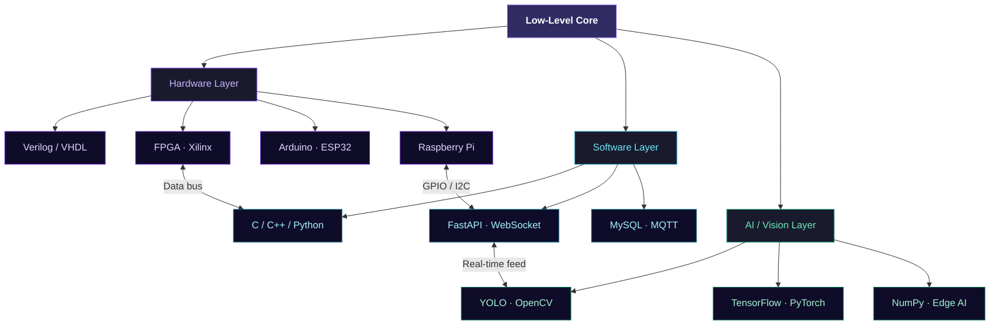

<!-- MUAZ AHMED — GitHub Profile README -->

<div align="center">


<br/>

[](https://git.io/typing-svg)

<br/>

[](https://www.linkedin.com/in/muazahmed-jmi/)
[](mailto:muazahmedofficial@gmail.com)
[](https://github.com/muaz-ahmd)
[](https://instagram.com/_muaz_._ahmed)


</div>

---

<div align="center">

## About Me

</div>

```verilog
module muaz_ahmed (
  input  wire  curiosity,
  output reg   innovation
);

  parameter UNIVERSITY  = "Jamia Millia Islamia";
  parameter DEGREE      = "B.Tech — Electronics Engineering";
  parameter LOCATION    = "New Delhi, India";

  always @(posedge curiosity) begin
    innovation <= 1;

    // Domains
    explore("Low Level Computer Systems");
    explore("VLSI Design & Verification");
    explore("Embedded Systems & FPGA");
    explore("Computer Vision & AI/ML");

    // Off the clock
    play("Football");
    pursue("Exploring Emerging Tech");
  end

endmodule
```

---

<div align="center">

## Interests

| Domain | Proficiency |
|:-------|:------------|
| Low-Level Systems & Architecture | `████████████████████` 95% |
| VLSI / FPGA Design               | `████████████████████` 92% |
| Embedded Development             | `███████████████████░` 90% |
| Computer Vision                  | `█████████████████░░░` 82% |
| AI / ML                          | `████████████████░░░░` 78% |

</div>

---

<div align="center">

## Tech Stack

### Hardware & HDL

<p>
  
  
  
  
  
  
</p>

### Languages

<p>
  
  
  
  
  
</p>

### AI / ML & Vision

<p>
  
  
  
  
  
  
</p>

### Backend & Connectivity

<p>
  
  
  
  
  
</p>

### Tools & Platforms

<p>
  
  
  
  
  
  
  
</p>

</div>

---

<div align="center">

## GitHub Stats

<a href="https://github.com/muaz-ahmd">
  
  
</a>

<br/>

[](https://git.io/streak-stats)

</div>

---

<div align="center">

## Focus Distribution

| Area | Distribution |
|:-----|:-------------|
| Hardware / VLSI  | `████████████████░░░░░░░░` 32% |
| Embedded Systems | `██████████████░░░░░░░░░░` 28% |
| Computer Vision  | `█████████░░░░░░░░░░░░░░░` 18% |
| AI / ML Research | `███████░░░░░░░░░░░░░░░░░` 14% |
| Open Source      | `████░░░░░░░░░░░░░░░░░░░░`  8% |

</div>

---

<div align="center">

## Domain Architecture



</div>

---

<div align="center">

## Contribution Graph

[](https://github.com/ashutosh00710/github-readme-activity-graph)

</div>

---

<div align="center">


*"Hardware is the soul, software is the mind — I speak both."*

</div>
