<!-- MUAZ AHMED — GitHub Profile README -->

<div align="center">


<br/>

[](https://git.io/typing-svg)

<br/>

[](https://www.linkedin.com/in/muazahmed-jmi/)
[](mailto:muazahmedofficial@gmail.com)
[](https://github.com/muaz-ahmd)
[](https://instagram.com/_muaz_._ahmed_)


</div>

---

<div align="center">

## About Me

</div>

```verilog
module muaz_ahmed (
  input  wire  curiosity,
  output reg   innovation
);

  parameter UNIVERSITY  = "Jamia Millia Islamia";
  parameter DEGREE      = "B.Tech — Electronics Engineering";
  parameter LOCATION    = "New Delhi, India";

  always @(posedge curiosity) begin
    innovation <= 1;

    // Domains
    explore("Low Level Computer Systems");
    explore("VLSI Design & Verification");
    explore("Embedded Systems & FPGA");
    explore("Computer Vision & AI/ML");

    // Off the clock
    play("Football");
    pursue("Exploring Emerging Tech");
  end

endmodule
```

---

<div align="center">

## Interests

| Domain | Proficiency |
|:-------|:------------|
| Low-Level Systems & Architecture | `████████████████████` 95% |
| VLSI / FPGA Design               | `████████████████████` 92% |
| Embedded Development             | `███████████████████░` 90% |
| Computer Vision                  | `█████████████████░░░` 82% |
| AI / ML                          | `████████████████░░░░` 78% |

</div>

---

 <div align="center">

## Tech Stack

<p>
  <!-- Hardware -->
  <a href="https://www.arduino.cc/" target="_blank">
    
  </a>
  &nbsp;&nbsp;
  <a href="https://www.raspberrypi.org/" target="_blank">
    
  </a>
  &nbsp;&nbsp;
  <a href="https://www.espressif.com/" target="_blank">
    
  </a>

  &nbsp;&nbsp;&nbsp;&nbsp;&nbsp;&nbsp;

  <!-- Languages -->
  <a href="https://www.cprogramming.com/" target="_blank">
    
  </a>
  &nbsp;&nbsp;
  <a href="https://www.python.org/" target="_blank">
    
  </a>
  &nbsp;&nbsp;
  <a href="https://www.gnu.org/software/bash/" target="_blank">
    
  </a>
  &nbsp;&nbsp;
  <a href="https://www.rust-lang.org/" target="_blank">
    
  </a>

  &nbsp;&nbsp;&nbsp;&nbsp;&nbsp;&nbsp;

  <!-- AI -->
  <a href="https://opencv.org/" target="_blank">
    
  </a>
  &nbsp;&nbsp;
  <a href="https://www.tensorflow.org/" target="_blank">
    
  </a>
  &nbsp;&nbsp;
  <a href="https://pytorch.org/" target="_blank">
    
  </a>
  &nbsp;&nbsp;
  <a href="https://numpy.org/" target="_blank">
    
  </a>

  &nbsp;&nbsp;&nbsp;&nbsp;&nbsp;&nbsp;

  <!-- Backend -->
  <a href="https://fastapi.tiangolo.com/" target="_blank">
    
  </a>
  &nbsp;&nbsp;
  <a href="https://www.mysql.com/" target="_blank">
    
  </a>
  &nbsp;&nbsp;
  <a href="https://www.docker.com/" target="_blank">
    
  </a>
  &nbsp;&nbsp;
  <a href="https://git-scm.com/" target="_blank">
    
  </a>
  &nbsp;&nbsp;
  <a href="https://www.linux.org/" target="_blank">
    
  </a>
</p>

<br/>

<p>
  <b>Low-Level:</b> Verilog · VHDL · FPGA (Xilinx) &nbsp;&nbsp;|&nbsp;&nbsp;
  <b>Systems:</b> Embedded · Edge AI · Computer Vision &nbsp;&nbsp;|&nbsp;&nbsp;
  <b>Connectivity:</b> MQTT · WebSockets · REST APIs
</p>

</div>

---

<div align="center">

## GitHub Stats

<a href="https://github.com/muaz-ahmd">
  
  
</a>

<br/>

[](https://git.io/streak-stats)

</div>

---

<div align="center">

## Focus Distribution

| Area | Distribution |
|:-----|:-------------|
| Hardware / VLSI  | `████████████████░░░░░░░░` 32% |
| Embedded Systems | `██████████████░░░░░░░░░░` 28% |
| Computer Vision  | `█████████░░░░░░░░░░░░░░░` 18% |
| AI / ML Research | `███████░░░░░░░░░░░░░░░░░` 14% |
| Open Source      | `████░░░░░░░░░░░░░░░░░░░░`  8% |

</div>

---

<div align="center">

## Domain Architecture

```mermaid
graph TD
    A["Low-Level Core"] --> B["Hardware Layer"]
    A --> C["Software Layer"]
    A --> D["AI / Vision Layer"]

    B --> B1["Verilog / VHDL"]
    B --> B2["FPGA · Xilinx"]
    B --> B3["Arduino · ESP32"]
    B --> B4["Raspberry Pi"]

    C --> C1["C / C++ / Python"]
    C --> C2["FastAPI · WebSocket"]
    C --> C3["MySQL · MQTT"]

    D --> D1["YOLO · OpenCV"]
    D --> D2["TensorFlow · PyTorch"]
    D --> D3["NumPy · Edge AI"]

    style A fill:#302b63,stroke:#a78bfa,color:#ffffff,font-weight:bold
    style B fill:#1a1a2e,stroke:#7c3aed,color:#c4b5fd
    style C fill:#1a1a2e,stroke:#0891b2,color:#67e8f9
    style D fill:#1a1a2e,stroke:#059669,color:#6ee7b7
    style B1 fill:#0f0c29,stroke:#6d28d9,color:#ddd6fe
    style B2 fill:#0f0c29,stroke:#6d28d9,color:#ddd6fe
    style B3 fill:#0f0c29,stroke:#6d28d9,color:#ddd6fe
    style B4 fill:#0f0c29,stroke:#6d28d9,color:#ddd6fe
    style C1 fill:#0f0c29,stroke:#0e7490,color:#a5f3fc
    style C2 fill:#0f0c29,stroke:#0e7490,color:#a5f3fc
    style C3 fill:#0f0c29,stroke:#0e7490,color:#a5f3fc
    style D1 fill:#0f0c29,stroke:#047857,color:#a7f3d0
    style D2 fill:#0f0c29,stroke:#047857,color:#a7f3d0
    style D3 fill:#0f0c29,stroke:#047857,color:#a7f3d0
```



</div>

---

<div align="center">

## Contribution Graph

[](https://github.com/ashutosh00710/github-readme-activity-graph)

</div>

---

<div align="center">


*"Hardware is the soul, software is the mind — I speak both."*

</div>
